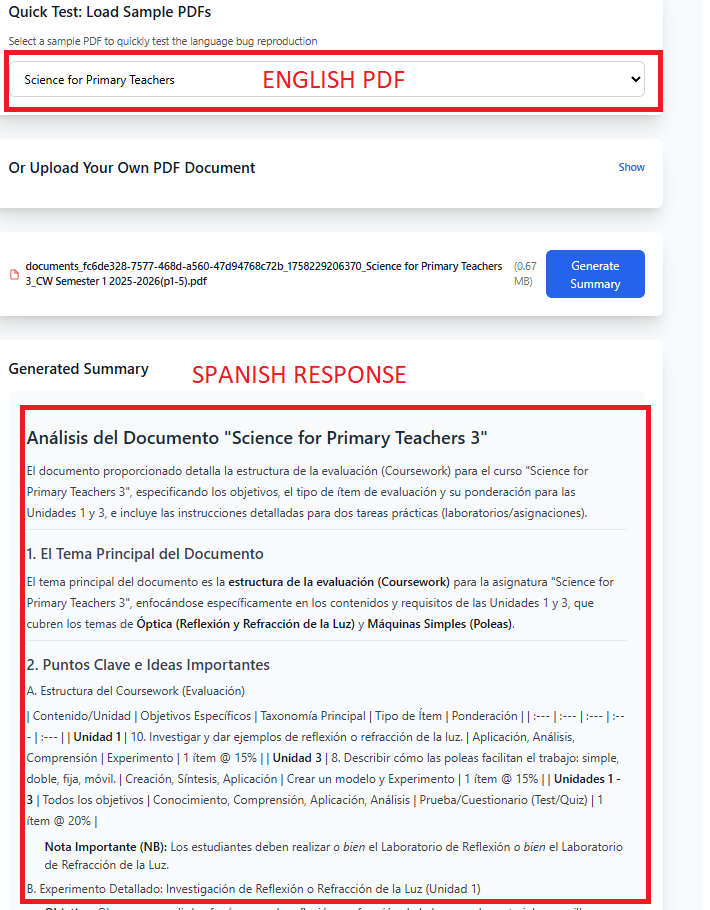

# Gemini PDF Language Bug Reproduction

This repository demonstrates a critical language preservation issue with Google's Gemini API when processing PDF documents.

**Reproduction Materials Included:**

- 📄 **Sample PDFs** in the `sample-pdfs/` folder - You can visually verify these are English documents
- 📸 **Bug Screenshots** in the `bug-screenshots/` folder - Actual responses from the model showing the language bug
- 🔧 **Working demo** - Full Next.js application to reproduce the issue yourself

## ⚠️ Critical Issue: Inconsistent Language Output

**Model**: `gemini-2.5-flash-lite-preview-09-2025`

**Problem**: When processing the **English PDF documents** (provided in `sample-pdfs/`) with explicit language instructions in the prompt, the model **inconsistently** returns summaries in incorrect languages (Italian, Spanish) instead of the original document language.

**Proof**: The `bug-screenshots/` folder contains actual responses generated by this model, clearly showing Italian/Spanish text despite the source documents being in English.

### Why This Makes the Model Unusable in Production

**You need to generate 2-3 times to reproduce the bug.** The language output is inconsistent:

- ❌ Sometimes the **entire response** is in Italian or Spanish
- ❌ Sometimes **parts of the response** are in English while other parts are in Italian/Spanish
- ✅ Sometimes the response is correctly in English

This inconsistency makes the model **impossible to use in production environments** where reliable, predictable output is required.

### Bug Examples (Screenshots)

The `bug-screenshots/` folder contains real examples of this issue:


_Example showing response in wrong language despite English source document_


_Example showing mixed languages in the same response_

### Key Facts

- **Reproduction Rate**: ~20-30% of requests
- **Affected Documents**: English PDFs
- **Prompt Instructions**: Explicitly requests "Write your response in the same language as the source document"
- **Model Behavior**: Ignores language instructions and outputs Italian/Spanish randomly
- **Similar Issue**: The same problem occurred with a "preview" version of Gemini Flash 2.0 a few months ago

### Testing Other Models

To isolate the issue, I tested the non-lite preview version:

- ✅ **gemini-2.5-flash-preview-09-2025** (non-lite): Tested 5 generations - **No language bug detected**
- ❌ **gemini-2.5-flash-lite-preview-09-2025** (lite): **Confirmed language bug**

**Conclusion**: The bug is **specific to the lite preview version only**. The regular preview model works correctly.

## Expected vs Actual Behavior

- **Expected**: Summary generated in the same language as the source PDF document (English)
- **Actual**: Summary appears in Italian, Spanish, or mixed languages regardless of:
  - The source document being in English
  - Explicit prompt instructions to preserve the original language
  - Multiple clear language directives in the prompt
- **Impact**: This unpredictability makes the model unreliable for any production use case

## Setup Instructions

1. Clone this repository
2. Install dependencies:

   ```bash
   npm install
   ```

3. Create a `.env.local` file with your Gemini API key:

   ```
   GEMINI_API_KEY=your_actual_gemini_api_key_here
   ```

4. Start the development server:

   ```bash
   npm run dev
   ```

5. Open [http://localhost:3000](http://localhost:3000) in your browser

## How to Reproduce the Bug

### Quick Test with Sample PDFs

The repository includes sample PDFs in the `sample-pdfs/` folder that reproduce the bug:

1. Start the development server: `npm run dev`
2. Open [http://localhost:3000](http://localhost:3000)
3. Select a sample PDF from the dropdown menu
4. Click **"Generate Summary"**
5. **Important**: If the response is in English, **click "Generate Summary" 2-3 more times**
6. Observe how the language changes inconsistently between generations

**Bug occurs when**: The summary is generated in Italian, Spanish, or mixed languages despite:

- The source document being in English
- The prompt explicitly requesting to "keep the response in the original language"
- The prompt containing "IMPORTANT: Write your response in the same language as the source document"

**Note**: The inconsistency is the main issue - the same document with the same prompt produces different language outputs on different runs.

### Test with Your Own PDFs

1. Upload any PDF document (preferably in English, French, or another non-Italian/Spanish language)
2. Click "Generate Summary"
3. Observe the generated summary language

## Technical Details

### Prompt Used

```
Analyze this PDF document and provide a detailed summary. Keep the response in the original language of the document.

Your summary should include:
1. The main subject of the document
2. Key points and important ideas
3. Main conclusions
4. An overview of the document structure

Format your response in markdown with clear sections and bullet points if necessary.

IMPORTANT: Write your response in the same language as the source document.

Here is the document to analyze:
```

### Model Configuration

- Model: `gemini-2.5-flash-lite-preview-09-2025`
- Input: PDF documents converted to base64
- Method: `generateContent` with inline data

## Test Files

### Included Sample PDFs

The `sample-pdfs/` folder contains documents that reproduce the bug:

1. **Science for Primary Teachers** - English education material
2. **Price Elasticity of Demand** - English economics material

Both documents are in English and should generate English summaries, but occasionally produce Italian or Spanish output.

### Additional Test Recommendations

To further test this issue, you can use:

- English PDF documents
- French PDF documents
- German PDF documents
- Any non-Italian/Spanish language documents

The bug is most noticeable when the expected output language differs significantly from Italian/Spanish.

## For Google Team

This reproduction case is designed to help identify and fix the language preservation issue. The complete prompt, model configuration, and processing pipeline are included for your analysis.

**Contact**: Please reach out if you need additional test cases or have questions about the reproduction steps.

## Dependencies

- Next.js 15.5.4
- @google/generative-ai 0.24.1
- react-dropzone 14.3.8
- TypeScript
- Tailwind CSS

## License

This reproduction case is provided for debugging purposes.
